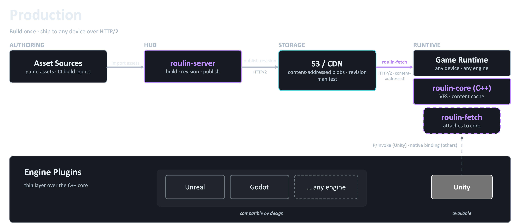

<div align="center">

# Roulin

**ゲームエンジン向けコンテンツアドレス型アセット配信**</br>

[English](README.md) | 日本語

[](https://github.com/KirisameMarisa/roulin/actions/workflows/ci.yml)
[](#ライセンス)
[]()

</div>

---

## 全体像



オーサリング側のアセットを `roulin-server` が取り込み、リビジョンとしてビルド・発行。コンテンツアドレス型 blob として S3 / CDN に publish されます。
実機側では `roulin-fetch` が HTTP/2 で blob を取得し、`roulin-core` の VFS に展開。各エンジンには薄いプラグイン層でつながり、Unity は現行対応、Unreal / Godot も同じ設計で接続できます。

---

## Highlights

**Blob レベルの重複排除**</br>
アセットは中身のハッシュで識別されるので、同じ内容のファイルはクラウド上に 1 度しか保存されません  
複数のリビジョンや複数のバンドルから同じ blob を共有できるため、共通部分の多いビルド同士はストレージをそのまま使い回せます

**カタログが長期運用でも肥大化しにくい**</br>
本番規模のタイトルでも1〜4 MB に収まり、何年開発を続けてもカタログが膨れ上がる事故が起こりにくい設計です  
HTTP リクエスト 1 回でカタログ全体が届くので、配信失敗のリスクも下がります  

**触ったアセットが、実機に即反映**</br>
Unity の Editor で保存したアセットを、ローカル PC と接続された実機端末にリビルドなしで転送できます
Texture / Material / Mesh / AudioClip / Prefab / ScriptableObject の6種に対応

**クラウドに縛られない**</br>
保存先は S3 互換ストアならどこでも (AWS S3 / Cloudflare R2 / MinIO / セルフホスト …)。
ベンダーを変えたくなっても、blob をコピーするだけで引っ越せます

**2 回目以降のビルドが速い**</br>
1 度フルビルドした後は、変わっていないバンドルの依存解析を丸ごとスキップ。
同じ仕組みが CI でも開発者のローカルでも効きます

**既存の Unity プロジェクトにそのまま入れられる**</br>
`Addressables.LoadAssetAsync<T>(...)` の呼び出しは書き換え不要
Addressables を使っている既存プロジェクトに、コードを触らず差し込めます

---

## Getting started

### 1. roulin-server を起動

```bash
docker compose up --build
```

roulin-server とローカル MinIO が自動で立ち上がります。AWS S3 など他のバックエンドを使う場合はバイナリを直接起動します:

```bash
roulin-server serve --storage s3://your-bucket/assets --port 8765
```

### 2. Unity パッケージのインストール

**Package Manager → Add package from git URL** から追加:

```
https://github.com/KirisameMarisa/roulin.git?path=plugins/unity
```

Unity 統合の詳細は **[docs/unity.md](docs/unity.md)** を参照。

---

## Roadmap

| 状態 | 項目 |
|---|---|
| ✅ | Unity Addressables 置き換え (LoadAssetAsync / DownloadDependenciesAsync / GetDownloadSizeAsync) |
| ✅ | BLAKE3 によるコンテンツアドレス型 S3 ストレージ |
| ✅ | バンドル単位メタデータによるウォームリビルド |
| ✅ | ライブデバイスデバッグ — USB ワンタイムペアリング → WiFi |
| ✅ | SSE ホットリロード (実機にアセット変更をストリーム) |
| 📋 | roulin-fetch ↔ Unity HTTP バックエンド (UnityWebRequest を libcurl HTTP/2 で置き換え) |
| 📋 | Unity 側 blob メタデータの FlatBuffers ワイヤーフォーマット対応 |
| 📋 | Unreal Engine / Godot プラグイン |
| 📋 | 暗号化 (ChaCha20、ランダムアクセス対応) |

---

## Components

| コンポーネント | 言語 | 役割 |
|---|---|---|
| `roulin-core` | C++17 | コンテンツアドレス型 VFS、FlatBuffers パース、C FFI |
| `roulin-fetch` | C++17 + libcurl | HTTP/2 並列ダウンローダー |
| `roulin-server` | Go 1.22+ | ステートレスな S3 バイパスサーバー (POST blobs/parcels、GET index/blobs) |
| `roulin-cli` | Go 1.22+ | `inspect-parcel` / `revisions` / `watch` (デバイスペアリング) |
| `plugins/unity` | C# (.NET Standard 2.1) | Unity UPM パッケージ |

---

## License

MIT — [LICENSE](LICENSE) を参照。
